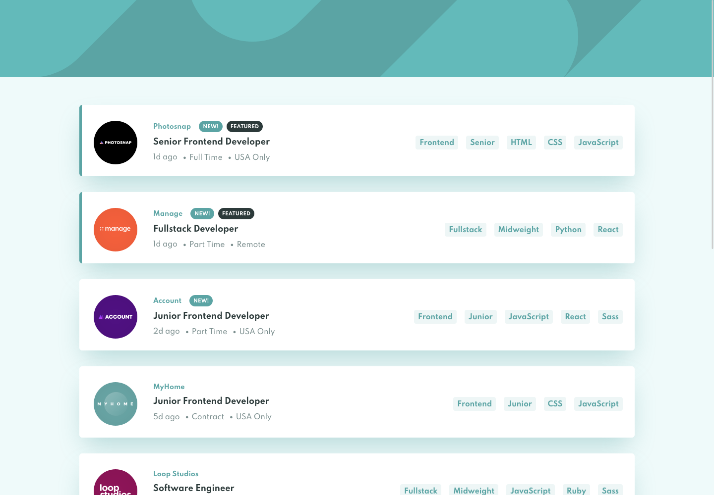

# Frontend Mentor - Job listings with filtering solution

This is a solution to the [Job listings with filtering challenge on Frontend Mentor](https://www.frontendmentor.io/challenges/job-listings-with-filtering-ivstIPCt). Frontend Mentor challenges help you improve your coding skills by building realistic projects.

## Table of contents

- [Frontend Mentor - Job listings with filtering solution](#frontend-mentor---job-listings-with-filtering-solution)
  - [Table of contents](#table-of-contents)
  - [Overview](#overview)
    - [The challenge](#the-challenge)
    - [Screenshot](#screenshot)
    - [Links](#links)
  - [My process](#my-process)
    - [Built with](#built-with)
    - [Useful resources](#useful-resources)
  - [Author](#author)

## Overview

### The challenge

Users should be able to:

- View the optimal layout for the site depending on their device's screen size
- See hover states for all interactive elements on the page
- Filter job listings based on the categories

### Screenshot

### Links

- Solution URL: [Solution GitHub page](https://github.com/tomhine/fm-job-listings-vue)
- Live Site URL: [Add live site URL here](https://your-live-site-url.com)

## My process

### Built with

- Flexbox
- CSS Grid
- Mobile-first workflow
- [Vue](https://vuejs.org/) - VueJS
- [Pinia](https://pinia.vuejs.org/) - Pinia for state management
- [Tailwind CSS](https://tailwindcss.com/) - Tailwind CSS for styles

### Useful resources

- [Vue JS docs](https://vuejs.org/guide/introduction.html) - The Vue docs are always the first place I go to.
- [LearnVue](https://learnvue.co/) - Lots of great articles and videos across Vue topics, used mostly for transitions on this project

## Author

- Frontend Mentor - [@tomhine](https://www.frontendmentor.io/profile/tomhine)
- Twitter - [@tomehine](https://www.twitter.com/tomehine)
